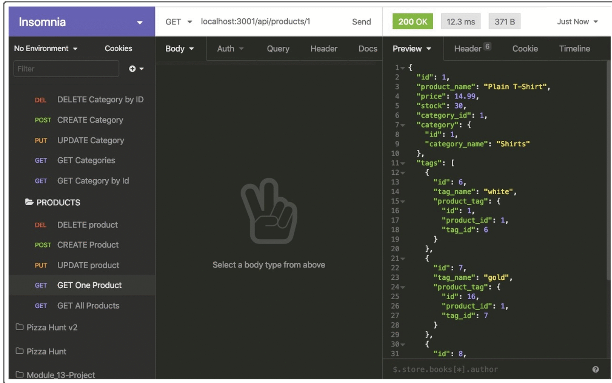

# E-commerce Back End Starter Code

### This app will be used as a back end application for the client who needs to be able to get categories, products and tags, post put and delete from database using Insomnia
### You can .

### badges

## Table of Contents

- [installation](#installation)
- [contribution guidelines](#contribution)
- [Test Instructions](#testing)
- [License](#license)
- [Questions](#questions)

### Installation
You can use the following by cloning the github repository and starting the server using npm start, then use Insomnia to test the routing

### Contribution Guidelines
N/A as of yet
### Testing
Multiple days were spent testing to ensure proper data was being written to the JSON file and retrieved properly.
### Questions
    email address : kevinnivek@me.com
    - additional instructions 
    I can be contacted by phone as well, but prefer email contact first.

### Image of example readme.md

### 
link to video on how this app works :

https://drive.google.com/file/d/1LqsOR5WzLS7Wxg9o3qNVWvMOMjuCa1Yp/view

